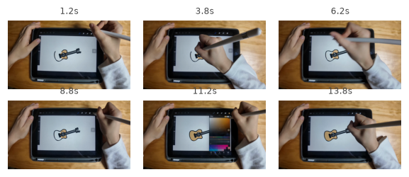
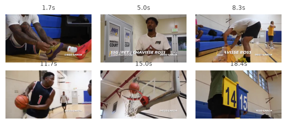

# Cookbook — Qwen-MM-Plugins API

`qwen-mm-plugins-api` calls cloud models to understand images, video, and audio. Local file reading
and visualization live in [`core`](../core/usage.md); web verification lives in
[`search`](../search/usage.md).

---

## Tools

### VL — Qwen-VL through an OpenAI-compatible endpoint

- `vision_chat` — chat about one or more images or videos; accepts local paths and URLs through its
  `images` and `videos` lists and supports `dry_run=true`
- `ocr` — recognize text in a local image
- `grounding` — locate objects in a local image; returns both pixel boxes and normalized `0–1000`
  boxes and can optionally return an annotated preview

Pass `grounding`'s `bbox_normalized` values—not `bbox_pixel`—to core's `draw_bbox`.

### Omni — Qwen-Omni audio/video understanding

| Tool | Use it for | Main output |
|---|---|---|
| `omni_asr` | Plain speech transcription | Continuous transcript |
| `omni_asr_timestamped` | Sentence- or word-level ASR | Timestamped JSON and optional SRT |
| `omni_multi_speaker_asr` | Speaker diarization | Speaker-labelled segments and optional SRT |
| `omni_av_caption` | Detailed audio/video review | Five-section Markdown report: storyline, visible text, speaker transcript, compliance alerts, and safety findings |
| `omni_av_grounding` | Find when an event appears | Matching start/end times |
| `omni_av_counting` | Count an event, object, or action | Count plus occurrence timestamps |
| `omni_music_caption` | Analyze a complete music track | Structured music tags and an English caption |

All Omni tools accept a local audio/video `file_path` or an HTTP(S)/OSS URL and support
`dry_run=true`. The audio/video tools also expose `fps` and `max_pixels` where visual sampling is
relevant.

### Other backends

- `transcribe_audio` — transcribe a local audio/video file with Qwen3-ASR (default
  `qwen3-asr-flash`) or `ASR_SERVER_URLS`; outputs SRT, text, or JSON
- `segmentation` — text-prompted segmentation of a local image through a self-hosted SAM3 server

For exact schemas, check the installed Skill or MCP tool list; these groups intentionally do not
share one universal input schema.

---

## Runtime tool and model selection

The agent can choose a tool and override its backend model for each call. State both explicitly in
the prompt when the distinction matters, for example:

```text
Use vision_chat with model qwen3.6-flash to summarize the slides in @demo.mp4, then use
omni_asr_timestamped with model qwen3.5-omni-plus to produce sentence-level subtitles.
```

This selects the model called by `qwen-mm-plugins-api`; it does not change the host agent's own
model. VL calls resolve the model as explicit `model` → `QWEN_MM_API_VL_MODEL` → `qwen3.7-plus`.
Omni calls use explicit `model` → `QWEN_MM_API_OMNI_MODEL` → `qwen3.5-omni-plus`. One prompt may
therefore mix tools and models without changing the configured defaults.

MCP `tools/list` shows the available tools and their schemas, but the plugin does not expose a
dynamic `list_models` tool. The following model IDs are practical examples, not an exhaustive or
per-account availability guarantee. Check the linked provider catalogs because region, workspace,
activation, and model lifecycle can differ.

### `vision_chat` model examples

| Model ID | Suggested use | Notes |
|---|---|---|
| `qwen3.7-plus` | Flagship image/video understanding | Built-in default; up to two-hour videos on supported DashScope regions |
| `qwen3.6-plus` | Strong image/video understanding | Alternative Qwen general-purpose visual model |
| `qwen3.6-flash` | Lower-cost, lower-latency image/video understanding | Recommended cost-oriented alternative |
| `qwen3-vl-plus` | Qwen3-VL visual reasoning | Older dedicated VL family; up to one-hour videos |
| `qwen3-vl-flash` | Faster Qwen3-VL visual reasoning | Older dedicated VL family; up to one-hour videos |
| `kimi/kimi-k3` | Third-party image/video understanding | Beijing workspace endpoint; requires the corresponding product activation |

See Model Studio's [visual-understanding catalog](https://help.aliyun.com/en/model-studio/vision-model/)
and [Kimi API guide](https://help.aliyun.com/en/model-studio/kimi-api) for current IDs, snapshots,
regional endpoints, and limits. A self-hosted OpenAI-compatible endpoint may accept other model IDs.

### Omni model examples

| Model ID | Suggested use | Notes |
|---|---|---|
| `qwen3.5-omni-plus` | Highest-quality audio/video understanding | Built-in default; non-realtime HTTP alias |
| `qwen3.5-omni-flash` | Lower-cost audio/video understanding | Non-realtime HTTP alias |
| `qwen3-omni-flash` | Short, cost-sensitive audio/video requests | Non-realtime HTTP; input limited to about 150 seconds |
| `qwen3.5-omni-plus-2026-03-15` | Reproducible Plus behavior | Snapshot behind the current Plus alias at publication time |
| `qwen3.5-omni-flash-2026-03-15` | Reproducible Flash behavior | Snapshot behind the current Flash alias at publication time |

See Model Studio's [Omni catalog](https://help.aliyun.com/en/model-studio/omni/) for current model
IDs and limits. Do not pass a `*-realtime` model to these tools: realtime models use a WebSocket
API, while this plugin uses non-realtime HTTP chat completions.

---

## Install

```bash
claude plugin marketplace add https://github.com/QwenLM/Qwen-MM-Plugins.git
claude plugin install qwen-mm-plugins-core@qwen-mm-plugins  # local reading/annotation
claude plugin install qwen-mm-plugins-api@qwen-mm-plugins
```

`core` is not a Python dependency of `api`, but it supplies the local reading, frame extraction, and
annotation steps commonly used around API calls.

---

## Requirements and configuration

| Requirement | Used by |
|---|---|
| `DASHSCOPE_API_KEY` | VL, Omni, and the default Qwen3-ASR path |
| `DASHSCOPE_BASE_URL` | VL and Omni OpenAI-compatible calls; it does not redirect native Qwen3-ASR |
| `QWEN_MM_API_VL_MODEL` | Default model for `vision_chat`, `ocr`, and `grounding` when a call omits `model` |
| `QWEN_MM_API_OMNI_MODEL` | Default model for all Omni tools when a call omits `model` |
| `QWEN_MM_AUDIO_RAW_B64=1` | Self-hosted OpenAI-spec Omni servers that expect raw audio base64; leave unset for DashScope |
| `ASR_SERVER_URLS` | Optional self-hosted Qwen3-ASR fallback; can be used without a DashScope key |
| `SAM3_SERVER_URL` | Required only for `segmentation` |
| ffmpeg + ffprobe | Local video sampling, audio extraction, fitting, and transcoding |

Set configuration through the installer's **Configure** action, environment variables, or
`~/.qwen-mm-plugins/config`; environment variables take precedence. `bash install.sh verify` checks
system dependencies and reports the DashScope key, but it does not make live requests to every
configured provider.

Pointing `DASHSCOPE_BASE_URL` at a server other than DashScope is supported. When optional
DashScope-only request hints are present, a 400/422 response drops those hints and retries the call
once without them. This applies to `grounding`'s `enable_thinking` optimization and `vision_chat`'s
opt-in `vl_high_resolution_images`; the latter falls back to the endpoint's default resolution.

### Optional OSS delivery

OSS requires all of `OSS_AK`, `OSS_SK`, `OSS_ENDPOINT`, and `OSS_BUCKET`, plus the Python `oss2`
dependency. The standard marketplace command above installs `[api]`, not `[api,oss]`; to use the OSS
path, register an MCP command with both extras against the same released tag:

```bash
claude mcp add qwen-mm-plugins-api-oss -- \
  uvx --from \
  "qwen-mm-plugins[api,oss] @ git+https://github.com/QwenLM/Qwen-MM-Plugins.git@qwen-mm-plugins-api-v<version>" \
  qwen-mm-plugins-api
```

Do not keep this direct registration enabled alongside the marketplace API MCP server.

---

## Video delivery

Remote HTTP(S)/OSS URLs are passed to the model for server-side fetching. Local videos follow two
different routes:

- **VL (`vision_chat`)** — with complete OSS configuration and the `oss` extra, a video within the
  model's duration cap is uploaded and passed as a signed URL. Otherwise it is sampled into local
  inline frames, capped at 250 total media items.
- **Omni** — first transcodes the video to fit one inline media item. If it cannot fit, it uses OSS
  when available; otherwise it falls back to sampled frames plus a fitted audio track. A video over
  the model's server-side duration cap goes directly to the frames + audio route. Extremely long
  audio can still exceed the inline budget, so this fallback is not an unlimited transport.

`dry_run=true` previews routing without uploading or calling the model.

For whole-video QA over long recordings, use [`video-memory`](../video-memory/usage.md) to locate
candidate segments, then inspect a narrow interval with core's `read_video`.

---

## Example requests

```text
@receipt.jpg
OCR this receipt and total the line items.

@meeting.mp4
Transcribe this meeting with speaker labels and sentence-level timestamps. Return SRT.

@demo.mp4
Describe the clip over time, then locate when the presenter first opens the settings panel.

@workout.mp4
Count every completed push-up and list the timestamp of each repetition.
```

---

## Shared Case: local views, cloud grounding, and web verification

This Codex session locates cakes, annotates the image, identifies a photographed place, and verifies
the result on the web. The API part uses grounding and vision reasoning; local file/annotation work
belongs to [`core`](../core/usage.md#shared-case-local-views-cloud-grounding-and-web-verification),
and external verification belongs to
[`search`](../search/usage.md#shared-case-local-views-cloud-grounding-and-web-verification).

▶ **[View the shared detailed trace](https://qianwen-res.oss-accelerate.aliyuncs.com/Qwen-MM-Plugins/asserts/core/case-core-codex-api-use.html)**

Each case below was recorded against a live DashScope endpoint: the **Call** shows the exact
arguments passed to the tool. Every tool returns the same shape — one JSON block carrying the
structured result, then a short plain-text summary — and the **Output** reproduces the returned
blocks verbatim. The clips live in [assets/](assets/); provenance and trimming notes are in
[assets/SOURCES.md](assets/SOURCES.md).

### Case 1 — transcribe and timestamp a short English clip (`omni_asr` + `omni_asr_timestamped`)

`guess_age_gender.wav` (9 s) — a single English question about guessing age/gender from voice.

**Call**

```python
omni_asr(
    file_path="assets/guess_age_gender.wav",
    language="en",
)
```

**Output** — JSON block, then summary block

```json
{ "text": "I heard that you can understand what people say and even know their age and gender. So can you guess my age and gender from my voice?" }
```

```text
I heard that you can understand what people say and even know their age and gender.
So can you guess my age and gender from my voice?
```

**Call** — sentence-level timestamps, SRT format

```python
omni_asr_timestamped(
    file_path="assets/guess_age_gender.wav",
    language="en",
    granularity="sentence",
    format="srt",
)
```

**Output** — JSON block (segment detail), then SRT block

```json
{
  "granularity": "sentence",
  "segments": [
    { "start": 0.647, "end": 5.387,
      "text": "I heard that you can understand what people say and even know their age and gender." },
    { "start": 5.907, "end": 9.017,
      "text": "So can you guess my age and gender from my voice?" }
  ]
}
```

```text
1
00:00:00,647 --> 00:00:05,387
I heard that you can understand what people say and even know their age and gender.

2
00:00:05,907 --> 00:00:09,017
So can you guess my age and gender from my voice?
```

### Case 2 — speaker diarization on a two-person interview (`omni_multi_speaker_asr`)

`interview_clip.wav` (35 s) — one interviewer, one interviewee; the tool splits the speech by
speaker without being told how many there are.

**Call**

```python
omni_multi_speaker_asr(
    file_path="assets/interview_clip.wav",
    format="json",
)
```

**Output** — JSON block (speaker detail), then SRT block

```json
{
  "speakers": ["Speaker 1", "Speaker 2"],
  "segments": [
    { "speaker": "Speaker 1", "start": 0.0,  "end": 26.38,
      "text": "you cut yourself but you don't mind and so you're not going to do a lot to avoid being cut again. So this region exists also in the rat and it's a relatively deep brain region so therefore we turn to the rat and figured in the rat we can change the activity in that brain region and see whether that would then change how much a rat would be averse to harming other rats or not." },
    { "speaker": "Speaker 2", "start": 29.87, "end": 32.95,
      "text": "Could you briefly explain this study and its findings?" },
    { "speaker": "Speaker 1", "start": 34.33, "end": 34.83, "text": "Ah." }
  ]
}
```

```text
1
00:00:00,000 --> 00:00:26,380
[Speaker 1] you cut yourself but you don't mind and so you're not going to do a lot to avoid being cut again. So this region exists also in the rat and it's a relatively deep brain region so therefore we turn to the rat and figured in the rat we can change the activity in that brain region and see whether that would then change how much a rat would be averse to harming other rats or not.

2
00:00:29,870 --> 00:00:32,950
[Speaker 2] Could you briefly explain this study and its findings?

3
00:00:34,330 --> 00:00:34,830
[Speaker 1] Ah.
```

### Case 3 — understand a video over time (`omni_av_caption`)

`draw1_clip.mp4` (15 s) — a tablet screen-recording of someone drawing a ukulele. The tool returns
per-span descriptions plus speaker/transcript, visible-text, and safety sections; it reads the
drawn object, the canvas UI, the artist's gestures, and the voice-over.

<p align="center">
  
</p>

**Call**

```python
omni_av_caption(
    file_path="assets/draw1_clip.mp4",
)
```

**Output** (abridged — full block is ~4,400 chars)

```text
## Storyline

00:00.000 – 00:02.500
... On the tablet's screen is a cartoon-style drawing of a small guitar-like instrument (ukulele
or acoustic guitar) ... At this moment a young female voice ... says, "Hello, take a look at what
I'm drawing." ...

00:02.500 – 00:06.500
... she traces and refines the existing black outline around the guitar's body, neck, and
headstock, making deliberate strokes ...

00:06.500 – 00:10.000
... she fills the interior of the guitar's body more completely with the same tan hue, smoothing
out any gaps ...

00:10.000 – 00:13.000
The artist taps an icon ... a vertical color-selection panel slides out ... Across the top of the
panel appears the Chinese word "颜色," meaning "Color." ...

00:13.000 – 00:15.000
The color panel retracts ... The video ends with the completed illustration still centered on the
screen ...

## Speakers and Transcript

Speaker profiles:
Artist/Narrator – Young adult female; clear diction, slight East-Asian accent ...

00:00.588 – 00:03.228
Speaker: Artist/Narrator
Content: "Hello, take a look at what I'm drawing."
```

### Case 4 — locate and count a temporal event (`omni_av_grounding` + `omni_av_counting`)

`basketball_clip.mp4` (20 s) — one made basket mid-clip. Grounding finds **when** the event
happens; counting reports **how many** and where each occurrence is.

<p align="center">
  
</p>

**Call**

```python
omni_av_grounding(
    file_path="assets/basketball_clip.mp4",
    query="a player making a basket",
)
```

**Output** — JSON block, then summary block

```json
{
  "query": "a player making a basket",
  "matches": [
    { "start": 13.0, "end": 17.0, "score": 0.95,
      "reason": "The video shows a player shooting the basketball and it successfully going through the hoop." }
  ]
}
```

```text
1 matching segment(s) for 'a player making a basket'.
```

**Call**

```python
omni_av_counting(
    file_path="assets/basketball_clip.mp4",
    target="dunk or made basket",
)
```

**Output** — JSON block, then summary block

```json
{
  "target": "dunk or made basket",
  "count": 1,
  "occurrences": [ { "start": 14.0, "end": 16.0, "note": "dunk or made basket" } ]
}
```

```text
Counted 1 occurrence(s) of 'dunk or made basket'.
```

### Case 5 — analyze a music track (`omni_music_caption`)

`music_40s.wav` (27 s) — acoustic-folk song with a female voice. The tool returns structured tags
plus a dense English caption that can feed straight into a music-generation model.

**Call**

```python
omni_music_caption(
    file_path="assets/music_40s.wav",
)
```

**Output** — JSON block (structured tags), then summary block (caption)

```json
{
  "genre": ["folk", "acoustic", "singer-songwriter"],
  "moods": ["calm", "gentle", "reflective", "intimate"],
  "instruments": ["piano", "acoustic guitar", "xylophone"],
  "has_vocals": true,
  "vocal_language": "english",
  "vocal_gender": "female",
  "vocal_timbre": ["soft", "clear", "conversational"],
  "key": "c major",
  "time_signature": "4/4",
  "caption": "A gentle and reflective acoustic folk piece featuring a simple, repeating piano melody accompanied by the bright, percussive tones of a xylophone. An acoustic guitar enters with warm, strummed chords, creating an intimate and calming atmosphere. The arrangement is sparse and organic, focusing on the natural timbres of the instruments. A soft, clear female voice speaks conversationally over the music, adding a personal and narrative layer to the serene soundscape."
}
```

```text
A gentle and reflective acoustic folk piece featuring a simple, repeating piano melody accompanied by the bright, percussive tones of a xylophone. An acoustic guitar enters with warm, strummed chords, creating an intimate and calming atmosphere. The arrangement is sparse and organic, focusing on the natural timbres of the instruments. A soft, clear female voice speaks conversationally over the music, adding a personal and narrative layer to the serene soundscape.
```
> The trace predates the capability split, so API calls appear under the old
> `qwen_mm_plugins_core` namespace. Today `grounding`, `ocr`, and `vision_chat` are provided by
> `qwen-mm-plugins-api`; the recorded inputs and outputs remain representative of the shared
> workflow.

<p align="center">
  
</p>
