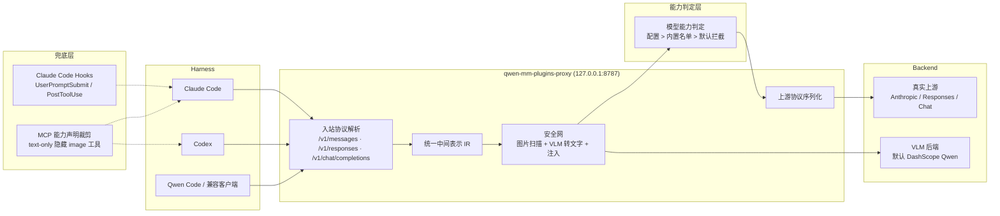

# Qwen-MM-Plugins 代理安全网设计（proxy capability）

> 日期：2026-08-13
> 状态：设计稿（待用户审阅）
> 目标仓库：QwenLM/Qwen-MM-Plugins（开发从 fork 开始，成熟后回馈上游）
> 范围：为 Skill + MCP 插件体系增加一层协议代理安全网，解决“纯文本模型接收图片导致报错”和“工具/用户图片漏进上下文”的问题。

## 1. 背景与目标

Qwen-MM-Plugins 目前以 Skill + MCP server 形式为 Claude Code、Codex、Qoder、OpenClaw、Qwen Code、Gemini CLI 等 harness 提供多模态能力。但 Skill/MCP 属于“工具调用层”，存在天然盲区：

- 用户消息里直接粘贴的图片，由 harness 组装进请求，Skill/MCP 工具层看不到、拦不住。
- 工具调用返回的图片块（例如 `read_image`、截图类工具）会被 harness 原样放进上下文；如果主模型是纯文本模型，请求会报错或图片被静默丢弃。
- 模型对“何时调用哪个工具”是隐性决策，工具越多准确率越难保证。

社区现状（2026-08 调查）：没有主流 harness 内置“为纯文本模型做图片中转”的能力。现有方案分三派：

- 代理派（Codex++ PR #1550）：在模型与 harness 之间拦截请求，抽图转文字后替换，最无感，但当前实现绑定 CodexApp，且 Responses 协议下直连上游。
- Hook 派（CC-Vision、cc-vision-hook 等）：用 `UserPromptSubmit` / `PostToolUse` 把粘贴图和工具图转文字后 `additionalContext` 注入，但只能追加、不能删除原图，对“协议级硬拒绝图片”的模型无效。
- MCP 工具派（vision-bridge-mcp 等）：提供图片转文字的 MCP 工具，靠模型主动调用，不拦截。

本设计的目标：**在 Qwen-MM-Plugins 内新增 `proxy` capability，以协议代理为主、hooks 与 MCP 能力声明为兜底，在纯文本模型场景下统一拦截所有图片内容，并兼容多协议互转。**

## 2. 范围与第一版边界

第一版包含：

- 本地常驻 HTTP 代理，单端口支持三种入站协议：Anthropic Messages、OpenAI Responses、OpenAI Chat。
- 协议归一化层：9 种组合（入站 3 × 上游 3）的请求转换；流式转换第一版支持“入站=上游”直通，以及 Anthropic ↔ Chat 两种常见跨协议转换，其余跨协议流式留第二版。
- 图片处理管线：每次请求全量扫描、VLM 转文字、两层缓存、上下文预算、fail-open。
- 模型能力判定：用户配置优先，内置供应商默认名单兜底，未知模型默认拦截。
- Claude Code 侧 hooks（UserPromptSubmit + PostToolUse）与 MCP 能力声明裁剪。
- 生命周期管理：`install.sh` 接入、`proxy start/stop/status/logs`、harness base_url 改写与回滚。

第一版不包含：

- Codex / Qwen Code 侧的 hooks（第一版只依赖代理）。
- TRAE、Kimi Code 等 harness 的 hooks 接入（留第二版）。
- relay 多供应商轮转（Codex++ 的 Aggregate 能力不属于本安全网目标）。
- 服务端部署（只做本地 127.0.0.1 代理）。
- 商业级进程守护（不引入 supervisor；macOS launchd 仅文档说明，用户可选项）。

## 3. 架构总览



核心原则：

- **base_url 一律指向本地代理**，无论什么协议，这是与 Codex++ 的关键差异（其 Responses 协议直连上游）。
- **安全网只做在 IR 层**，三协议只写一份图片处理逻辑。
- **vision 模型零开销直通**，不进入安全网。
- **任何失败都 fail-open**：安全网自身挂了也不能比没有安全网更糟。

## 4. 协议归一化层

### 4.1 入站协议识别

按请求路径与请求体结构识别协议，不按 harness 猜测：

- `/v1/messages` → Anthropic Messages
- `/v1/responses` → OpenAI Responses
- `/v1/chat/completions` → OpenAI Chat

解析失败返回明确的协议错误，不静默放行。

### 4.2 统一中间表示（IR）

IR 定义：

- `model`：模型名。
- `messages`：`role`（user/assistant/tool）+ 内容块列表，内容块类型统一为 `text` / `image` / `tool_use` / `tool_result`。
- `system`：系统提示（Anthropic 在顶层，OpenAI 在 messages[0]）。
- `tools`：工具定义。
- `stream`、`max_tokens`、`temperature`、`reasoning` 等参数。

各协议图片块归一化规则：

| 协议 | 图片输入 | IR 表示 |
|---|---|---|
| OpenAI Chat | `content[].image_url`（url 或 data URL） | `image { url }` |
| OpenAI Responses | `input[].input_image` 或 tool 输出 data URL | `image { url }` |
| Anthropic | `content[].source`（base64 + media_type） | `image { base64, media_type }` |

### 4.3 转换矩阵

请求转换：入站 3 × 上游 3 全部支持。相同协议直接透传结构；不同协议按 IR 重建。

流式转换：第一版支持

- 入站=上游：原样透传 SSE。
- Anthropic ↔ Chat：逐事件翻译（`content_block_delta` ↔ `choices[].delta`）。
- 其余跨协议流式：第二版。

### 4.4 与中继工具共存

CC Switch 等中继会把 Anthropic 转成 OpenAI 再发出；本代理在入站侧再接一层归一化，不依赖具体中继，只要入站是三种协议之一即可。

## 5. 图片处理管线

### 5.1 扫描范围

每次请求对 IR 全部消息扫描（最多最近 50 轮带图消息，黄金窗口 10 轮）。不只看本轮，原因：

- 当前轮是纯文本追问但历史有图时，需要注入历史图描述。
- 代理启用前已经进过上下文的图片需要兜底。
- 上下文预算需要基于全量计算。

### 5.2 能力判定接入

先查模型能力表：

- `vision`：整个请求直通，不进管线。
- `text_only`：进入管线。
- 未知：默认拦截（用户已确认，走一次 VLM）。

### 5.3 图片抽取

从 IR 图片块抽取 `url` / `base64` / `data URL`，用户消息与 tool_result 均覆盖。多图按 `[[图片K]]` 顺序标记。

### 5.4 VLM 调用

- 当前轮：有用户文字问题时用 Tier2（`URL+问题` 缓存键 + 聚焦 prompt）；无问题退回 Tier1（全面描述）。
- 历史轮：只用 Tier1。
- 批量：`BATCH_SIZE=5`，单批失败隔离、各自重试。
- 后端：默认 DashScope Qwen（`qwen3.5-omni-plus` / `qwen-vl-max`），可配任意 OpenAI-compatible 或 Anthropic 端点。

### 5.5 缓存

两层，磁盘持久化 + TTL，按图片内容哈希：

- Tier1：`URL → 描述`（历史轮/无问题当前轮）。
- Tier2：`(URL, 问题) → 描述`（有问题的当前轮）。

缓存命中不调 VLM。

### 5.6 注入与 fail-open

- 正常：在带图消息文本末尾追加 `[图片描述] {desc}`，多图用 `[[图片K]]` 前缀。
- fail-open / strip / 溢出：向最近 user 消息注入“看不到图”系统提示，文案风格按 Qwen 库（说明原因 + 操作建议 + 禁止编造）。
- 剥离模式：图片替换为 `[图片已省略]`。

### 5.7 上下文预算

- 先剥图估算纯文本 token，留 10% 安全余量。
- `X = available / AVG_DESC_BUDGET` 决定历史轮可注入描述数量。
- 当前轮不限量；预算不足优先最近消息；深层历史只保留缓存命中项。

### 5.8 追问检测

当前轮为纯文本、窗口内历史有图时，注入“描述未覆盖细节请重发图+问题，禁止编造”的提示。

## 6. 模型能力判定与 relay 配置

配置存放：`~/.qwen-mm-plugins/proxy.toml`（600 权限），由 `install.sh` Configure 读写。

### 6.1 判定优先级

1. 用户显式配置覆盖表。
2. 内置供应商默认名单。
3. 未知模型 → 默认拦截。

### 6.2 匹配规则

支持精确模型名、供应商前缀、通配符，按顺序匹配、命中即止。

内置默认名单（第一版）：

```toml
[model_capabilities]
"deepseek/*"       = "text_only"
"glm/*"            = "text_only"
"zai/*"            = "text_only"
"openai/*"         = "vision"
"anthropic/*"      = "vision"
"google/*"         = "vision"
"qwen-vl-*"        = "vision"
"qwen3.5-omni-*"   = "vision"
"kimi-k2.7-code*"  = "vision"
```

用户可新增例如 `"deepseek-vl-*" = "vision"`、`"openrouter/deepseek/*" = "text_only"`。

### 6.3 relay 配置

```toml
[[relays]]
name = "deepseek-official"
protocol = "responses"        # anthropic | responses | chat
base_url = "https://api.deepseek.com"
api_key = "…"
models = ["deepseek/*"]
capability = "text_only"      # 可选，覆盖模型名推断

[[relays]]
name = "claude-official"
protocol = "anthropic"
base_url = "https://api.anthropic.com"
api_key = "…"
models = ["anthropic/*"]
```

按请求 model + 入站协议匹配 relay；匹配不到用默认 relay。第一版不做轮转。

### 6.4 判定结果缓存

进程内缓存 `模型名 → 能力`，避免每个请求重复做规则匹配。

### 6.5 密钥安全

api_key 只存本地配置（600 权限）；客户端只发识别 relay 用的标记，真实上游 key 不下发到 harness；日志不写明文 key。

## 7. hooks / MCP 兜底层

### 7.1 Claude Code hooks

- `UserPromptSubmit`：用户粘贴图片时从 image-cache 目录取新图 → VLM 转文字 → `additionalContext` 注入。
- `PostToolUse`：通用递归提取器从 `tool_response` 抽图（兼容 MCP content-block 数组、Read 对象结构、Bash data URI）→ VLM 转文字 → `additionalContext` 注入。
- 内容哈希 + 磁盘缓存，同一图只描述一次。
- 已知边界：hooks 只能追加 `additionalContext`，不能删除原图；对协议级硬拒绝图片的模型必须靠代理。

### 7.2 MCP 能力声明裁剪

- 给现有 capability 增加 `output_modalities` 元数据：`core` 工具返回 `image`，`api` 工具返回 `text`。
- `text_only` 模型下：隐藏 core 中返回图片的工具，或让其返回文字占位；只保留 `api` 文字工具。
- `vision` 模型下：全部保留。
- 实现为“安装时 manifest 裁剪 + proxy 启动时配置注入”，不侵入 core/api 现有逻辑。

### 7.3 范围与开关

- 第一版 hooks 与 MCP 裁剪只做 Claude Code 侧，配置开关 `enable_hooks`、`enable_mcp_filter`（默认开）。
- Codex / Qwen Code 侧第一版只依赖代理。

## 8. 生命周期与 harness 接入

### 8.1 capability 形态

新增 `src/capabilities/proxy/`，Python，MCP 无关（常驻 HTTP server），入口 `qwen-mm-plugins-proxy`，遵循仓库 capability 规范（manifest、版本 tag、发布流程）。

### 8.2 安装器接入

`bash install.sh` 新增 `proxy` 能力，安装时：

- 生成 `~/.qwen-mm-plugins/proxy.toml` 默认配置。
- 改写 harness base_url 指向 `http://127.0.0.1:8787`：
  - Claude Code：`ANTHROPIC_BASE_URL` / settings 环境变量。
  - Codex：`~/.codex/config.toml` model provider `base_url`（覆盖 Codex++ 的 Responses 直连问题）。
  - Qwen Code / DashScope 兼容：`DASHSCOPE_BASE_URL`。
- 改写前备份原配置，`proxy uninstall` 可回滚。

### 8.3 运行命令

- `qwen-mm-plugins-proxy start`：启动常驻服务（默认绑定 `127.0.0.1:8787`，PID 文件 + 单实例锁）。
- `stop` / `status` / `logs`：停止、健康检查、查看结构化日志。
- `test-image <path>`：验证 VLM 后端连通与描述质量。
- `check`：`--check-system` 依赖自检（端口占用、VLM key、relay 配置）。

### 8.4 日志与观测

日志写到 `~/.qwen-mm-plugins/logs/proxy.log`，JSON 行，包含 `vl_call`（status/duration_ms/error）、`vl_strip`（reason/n）、`vlm_cache_hit` 等埋点，复用 Codex++ 的诊断日志思路。

## 9. 错误处理与容错

| 场景 | 行为 |
|---|---|
| VLM 调用失败 / 超时 | fail-open：注入“看不到图”提示后继续转发 |
| 上下文溢出 | 剥离图片 + 注入溢出提示 |
| 协议解析失败 | 返回明确错误，不静默放行 |
| 上游连接失败 | 原样透传错误 |
| 代理自身异常 | fail-open：不阻断请求，保证不比没有安全网更糟 |
| 缓存 miss + VLM 不可用 | 剥离图片 + fail-open 提示，历史缓存命中项仍注入 |
| 并发 | 请求并发处理；VLM 批量调用限流防打爆 |

## 10. 测试与发布

### 10.1 单元测试

- 协议解析/序列化：9 种组合请求转换。
- IR 归一化：三种协议图片块 ↔ IR ↔ 输出。
- 能力判定：精确/前缀/通配/覆盖/未知默认拦截。
- 图片管线：扫描（用户消息 + tool_result + data URL）、Tier1/Tier2、BATCH_SIZE 分批、缓存键、fail-open、注入格式、上下文预算、追问检测。

### 10.2 集成测试

- mock 上游（Anthropic/Responses/Chat）+ 真实代理，三种入站协议请求，断言上游收到无图片块、含描述。
- 流式：同协议直通、Anthropic ↔ Chat 跨协议转换。
- hooks：提取器对三种 tool_response 结构。

### 10.3 回归

- 现有 Qwen-MM-Plugins 测试保持通过：`python3 -m pytest -m "not reachability" tests/`、`python3 scripts/check_manifests.py`、`ruff format --check .`、`ruff check .`。
- `bash -n` 检查安装器脚本。

### 10.4 发布

- 新 capability 遵循仓库发布规范：`plugin-versions.json`、marketplace、harness manifests、独立 tag。

## 11. 与 Codex++ 的对比与优化

| 维度 | Codex++ PR #1550 | 本设计（Qwen-MM-Plugins proxy） |
|---|---|---|
| 覆盖 harness | 仅 CodexApp | Claude Code + Codex + Qwen Code，后续可扩展 TRAE/Kimi |
| 协议 | 仅 OpenAI（Responses/Chat），且 Responses 直连上游 | 三协议归一化，入站 3 × 上游 3，base_url 一律指向代理 |
| 图片安全网位置 | messages 数组层 | IR 层，三协议共用一份处理逻辑 |
| 工具/用户图片 | 代理层处理 tool data URL | 代理 + hooks + MCP 能力声明三层 |
| 模型能力判定 | per-model checkbox | 配置优先 + 内置供应商名单 + 未知默认拦截 |
| 注入格式 | 消息内追加 `[图片描述]` / fail-open 提示 | 同 Codex++ 位置，文案风格按 Qwen 库 |
| 缓存/预算 | 两层缓存 + golden window + X budget | 复用相同思路，加磁盘持久化 + TTL |
| 生命周期 | 内嵌于 Codex++ | 独立 capability + install.sh + 备份回滚 |

优化点：

- 修复 Codex++ 的 Responses 直连问题：本设计所有协议统一走本地代理。
- 通过 IR 归一化消除三份重复的图片处理实现。
- 补上 hooks 兜底与 MCP 工具面裁剪，覆盖代理覆盖不到的通道。
- 模型能力判定从“写死名单”改为“配置为主 + 名单兜底”，避免名称启发式误判。

## 12. 已确认决策记录

- 协议范围：方案 A，Claude Code（Anthropic）+ Codex / Qwen Code（OpenAI Responses/Chat）。
- 总体路线：方案 3，代理为主 + hooks/MCP 兜底 + 能力声明。
- 落地方式：在 Qwen-MM-Plugins fork 上新增 `proxy` capability，成熟后回馈上游。
- 未知模型：默认拦截，走一次 VLM。
- 注入格式：位置按 Codex++（消息内追加 + fail-open 系统提示），文案风格按 Qwen 库。
- 协议归一化：9 种请求转换全部实现；流式先做同协议直通 + Anthropic ↔ Chat。
- 兜底行为：按 Qwen-MM-Plugins 现有库的处理方式。

## 13. 风险与开放问题

- hooks 只能追加不能删除原图，对协议级硬拒绝图片的模型必须依赖代理。
- 跨协议流式转换（Responses ↔ 其他）留第二版，第一版限定同协议直通 + Anthropic ↔ Chat。
- TRAE / Kimi Code 的 hooks 接入、relay 轮转、服务端部署留后续版本。
- 未知模型默认拦截会引入额外 VLM 调用成本，后续可加“按供应商启发式自动学习”。
- 官方上游是否接受“常驻 HTTP 代理”这一新能力形态，取决于 PR 评审，fork 阶段不受影响。
